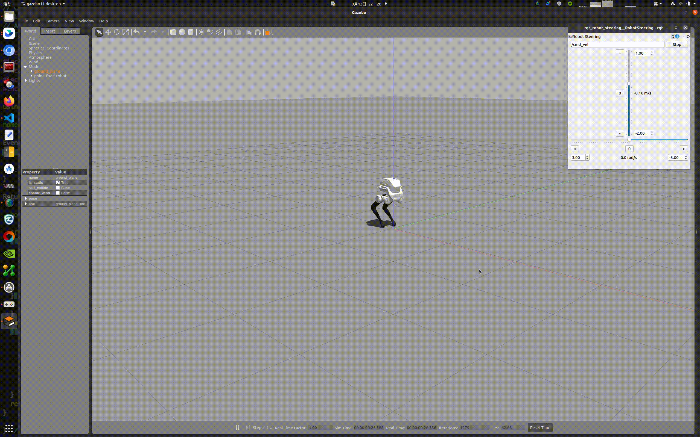

# 训练结果部署


## 1. 部署环境配置

- 安装ROS Noetic：我们推荐在Ubuntu 20.04操作系统上建立基于ROS Noetic的算法开发环境。ROS提供了一系列工具和库，如核心库、通信库和仿真工具（如Gazebo），极大地便利了机器人算法的开发、测试和部署。这些资源为用户提供了一个丰富而完整的算法开发环境。ROS Noetic 安装请参考文档：https://wiki.ros.org/noetic/Installation/Ubuntu ，选择“ros-noetic-desktop-full”进行安装。ROS Noetic 安装完成后，Bash终端输入以下Shell命令，安装开发环境所依赖的库：

    ```bash
    sudo apt-get update
    sudo apt install ros-noetic-urdf \
                 ros-noetic-kdl-parser \
                 ros-noetic-urdf-parser-plugin \
                 ros-noetic-hardware-interface \
                 ros-noetic-controller-manager \
                 ros-noetic-controller-interface \
                 ros-noetic-controller-manager-msgs \
                 ros-noetic-control-msgs \
                 ros-noetic-ros-control \
                 ros-noetic-gazebo-* \
                 ros-noetic-robot-state-* \
                 ros-noetic-joint-state-* \
                 ros-noetic-rqt-gui \
                 ros-noetic-rqt-controller-manager \
                 ros-noetic-plotjuggler* \
                 cmake build-essential libpcl-dev libeigen3-dev libopencv-dev libmatio-dev \
                 python3-pip libboost-all-dev libtbb-dev liburdfdom-dev liborocos-kdl-dev -y
    ```

    

## 2. 编译运行

可以按照以下步骤，编译运行项目：

- 打开一个Bash终端。

- 下载源代码：
    ```Bash
    git clone https://github.com/limxdynamics/tron1-rl-deploy-arm.git
    ```
    
- 编译工程：
    ```Bash
    cd tron1-rl-deploy-arm
    catkin_make install
    ```
    
- 选择机器人类型

  - 通过 Shell 命令 `tree -L 1 src/robot-description/pointfoot ` 列出可用的机器人类型：
  
    ```
    src/robot-description/pointfoot
    ├── SF_TRON1A
    └── WF_TRON1A
    ```
    
  - 以`SF_TRON1A`（请根据实际机器人类型进行替换）为例，设置机器人型号类型：
  
    ```
    echo 'export ROBOT_TYPE=SF_TRON1A' >> ~/.bashrc && source ~/.bashrc
    ```
  
- 运行仿真

  通过运行Shell命令启动Gazebo仿真器，然后在仿真器窗口中按 `Ctrl + Shift + R`，机器人将开始移动。您还可以通过将 `Robot Steering` 插件的发布主题设置为 `/cmd_vel` 来控制机器人的行走。
  
  
  ```
  source install/setup.bash
  roslaunch robot_hw pointfoot_hw_sim.launch
  ```
  

